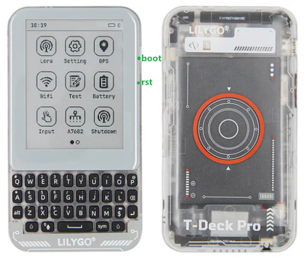

<h1 align = "center">🏆T-Deck-Pro V1.0🏆</h1>

 
<!-- </a> -->
</a>
</a>

## :zero: Version 🎁

T-Deck-Pro Hardware Version 

Different hardware versions may have incompatible codes. Confirm your hardware version and enter the corresponding `git branch`.

The differences in hardware can be viewed in the corresponding `readme` and `schematic` diagrams.

|        name         |                                                      git branch                                                      |                                                  change                                                   |                                                      schematic                                                       |                                   firmware                                    |     state     |
| :-----------------: | :------------------------------------------------------------------------------------------------------------------: | :-------------------------------------------------------------------------------------------------------: | :------------------------------------------------------------------------------------------------------------------: | :---------------------------------------------------------------------------: | :-----------: |
|   T-Deck-Pro V1.0   |     [HD-V1-250326](https://github.com/Xinyuan-LilyGO/T-Deck-Pro/tree/HD-V1-250326?tab=readme-ov-file#t-deck-pro)     | [readme](https://github.com/Xinyuan-LilyGO/T-Deck-Pro/tree/HD-V1-250326?tab=readme-ov-file#zero-version-) |     [SCH](https://github.com/Xinyuan-LilyGO/T-Deck-Pro/tree/HD-V1-250326/hardware/T-Deckpro%20v1.0%2024-05-16)       | [V1](https://github.com/Xinyuan-LilyGO/T-Deck-Pro/tree/HD-V1-250326/firmware) |   Available   |
|   T-Deck-Pro V1.1   |   [HD-V2-250915](https://github.com/Xinyuan-LilyGO/T-Deck-Pro/tree/HD-V2-250915?tab=readme-ov-file#t-deck-pro-v11)   | [readme](https://github.com/Xinyuan-LilyGO/T-Deck-Pro/tree/HD-V2-250915?tab=readme-ov-file#zero-version-) |     [SCH](https://github.com/Xinyuan-LilyGO/T-Deck-Pro/tree/HD-V2-250915/hardware/T-Deckpro%20v1.1%2025-09-15)       | [V2](https://github.com/Xinyuan-LilyGO/T-Deck-Pro/tree/HD-V2-250915/firmware) |   Available   |
|   T-Deck-Pro MAX    |                               [MAX](https://github.com/Xinyuan-LilyGO/T-Deck-Pro-MAX)                                |                 [readme](https://github.com/Xinyuan-LilyGO/T-Deck-Pro-MAX#zero-version-)                  |                     [SCH](https://github.com/Xinyuan-LilyGO/T-Deck-Pro-MAX/tree/master/hardware)                     |  [V3](https://github.com/Xinyuan-LilyGO/T-Deck-Pro-MAX/tree/master/firmware)  |   Available   |

🟢🟢🟢

How to distinguish between different versions of T-Deck-Pro;

Different versions can be distinguished by using the I2C function of the detection equipment.

|        name         | DRV2605 （0x5A） | XL9555 (0x20) |
| :-----------------: | :------------: | :-----------: |
|   T-Deck-Pro V1.0   |       ❌        |       ❌       |
|   T-Deck-Pro V1.1   |       ✅        |       ❌       |
| T-Deck-Pro MAX V0.1 |       ✅        |       ✅       |

Download the [WireScan](./firmware/examples/WireScan.bin) firmware and then open the serial port to confirm.

How to download the firmware? - [click me](./firmware/)

### 1、Version

The T-Deck-Pro comes in two versions, one with the audio module PCM512A and one with the 4G module A7682E

As shown in the figure below, the annotated modules of the two versions are different;

### 2、Where to buy.

[LilyGo Store](https://lilygo.cc/products/t-deck-pro)

## :one: Product 🎁

|       H693       |           T-Deck-Pro           |
| :--------------: | :----------------------------: |
|       MCU        |            ESP32-S3            |
|  Flash / PSRAM   |            16M / 8M            |
|       LoRa       |             SX1262             |
|       GPS        |            MIA-M10Q            |
|     Display      |      GDEQ031T10 (320x240)      |
|    4G-Module     |       A7682E  🟢Optional       |
|      Audio       |       PCM512A 🟢Optional       |
| Battery Capacity |        305070 (1400mAh)        |
|   Battery Chip   | BQ25896 (0x6B), BQ27220 (0x55) |
|      Touch       |         CST328 (0x1A)          |
|    Gyroscope     |        BHI260AP (0x28)         |
|     Keyboard     |         TCA8418 (0x34)         |

🟢🟢🟢

Other projects related to T-Deck-Pro

### 1. meshtastic

The T-Deck-Pro supports Meshtastic and provides the Meshtastic firmware in [firmware/meshtastic](./firmware/meshtastic/).

Firmware that has been tested:
~~~
T-Deck-Pro V1.0  <---  firmware-t-deck-pro-2.7.10.94d4bdf.bin 
T-Deck-Pro V1.1  <---  firmware-t-deck-pro-2.7.13.597fa0b.bin
~~~
How to download the firmware? - [click me](./firmware/)

Regarding the video of `T-Deck-Pro V1.x` : [Running Meshtastic on LILYGO T-Deck Pro](https://www.youtube.com/watch?v=qfrOp8PxDvA)

More information about Meshtastic reference：
[github](https://github.com/meshtastic/firmware) 、
[Meshtastic flasher](https://flasher.meshtastic.org/)

### 2. Launcher

Application Launcher for M5Stack, Lilygo, CYDs, Marauder and ESP32 devices.

It seems that the T-Deck-Pro device has already been supported.

reference：
[github](https://github.com/bmorcelli/Launcher)、
[Launcher](https://bmorcelli.github.io/Launcher/)

### 3. bb_epaper

A frustration-free e-paper library suitable for Arduino, Linux, or random embedded systems with no OS.

The author has added support for `T-Deck-Pro V1.0`.

More information about Meshtastic reference：
[github](https://github.com/bitbank2/bb_epaper)

## :two: Module 🎁

Datasheets on the chip are available in [./hardware](./hardware/) directory.
~~~
zinggjm/GxEPD2@1.5.5
jgromes/RadioLib@6.4.2
lewisxhe/SensorLib@^0.2.0
mikalhart/TinyGPSPlus @ ^1.0.3
vshymanskyy/TinyGSM@^0.12.0
lvgl/lvgl @ ~8.3.9
lewisxhe/XPowersLib @ ^0.2.4
adafruit/Adafruit TCA8418 @ ^1.0.1
adafruit/Adafruit BusIO @ ^1.14.4
olikraus/U8g2_for_Adafruit_GFX@^1.8.0
adafruit/Adafruit GFX Library@^1.11.10
esphome/ESP32-audioI2S#v3.0.12
~~~

### 1. A7682E

A7682E https://en.simcom.com/product/A7682E.html

Test the functionality of the A7682E using [`examples/A7682E/test_AT`](https://github.com/Xinyuan-LilyGO/T-Deck-Pro/tree/master/examples/A7682E/test_AT)

A7682E is the LTE Cat 1 module that supports wirelesscommunication modes of LTE-FDD/GSM/GPRS/EDGE.   It supports maximum 10Mbps downlink rate and 5Mbps uplink rate. A7682E supports multiple built-in network protocols.

Control Via AT Commands
~~~
Frequency Bands LTE-FDD B1/B3/B5/B7/B8/B20
GSM/GPRS/EDGE 900/1800 MHz
Supply Voltage 3.4V ~ 4.2V, Typ: 3.8V
LTE Cat 1   (Uplink up to 5Mbps, Downlink up to10Mbps)
EDGE        (Uplink/Downlink up to 236.8Kbps)
GPRS        (Uplink/Downlink up to 85.6Kbps)
Firmware update via USB/FOTA
Support language calls
Support sending and receiving SMS messages
network protocols (TCP/IP/IPV4/IPV6/Multi-PDP/FTP/FTPS/HTTP/HTTPS/DNS)
RNDIS/PPP/ECM
SSL
~~~

## :three: Quick Start 🎁

🟢 PlatformIO is recommended because these examples were developed on it. 🟢 

### 1、PlatformIO

1. Install [Visual Studio Code](https://code.visualstudio.com/) and [Python](https://www.python.org/), and clone or download the project;
2. Search for the `PlatformIO` plugin in the `VisualStudioCode` extension and install it;
3. After the installation is complete, you need to restart `VisualStudioCode`
4. After opening this project, PlatformIO will automatically download the required tripartite libraries and dependencies, the first time this process is relatively long, please wait patiently;
5. After all the dependencies are installed, you can open the `platformio.ini` configuration file, uncomment in `example` to select a routine, and then press `ctrl+s` to save the `.ini` configuration file;
6. Click :ballot_box_with_check: under VScode to compile the project, then plug in USB and select COM under VScode;
7. Finally, click the :arrow_right:  button to download the program to Flash;

### 2、Arduino IDE

1. Install [Arduino IDE](https://www.arduino.cc/en/software)

2. Copy all files under `this project/lib/` and paste them into the Arduino library path (generally `C:\Users\YourName\Documents\Arduino\libraries`);

3. Open the Arduino IDE and click `File->Open` in the upper left corner to open an example in `this project/example/xxx/xxx.ino` under this item;

4. Then configure Arduino. After the configuration is completed in the following way, you can click the button in the upper left corner of Arduino to compile and download;

| Arduino IDE Setting                  | Value                              |
| ------------------------------------ | ---------------------------------- |
| Board                                | ***ESP32S3 Dev Module***           |
| Port                                 | Your port                          |
| USB CDC On Boot                      | Enable                             |
| CPU Frequency                        | 240MHZ(WiFi)                       |
| Core Debug Level                     | None                               |
| USB DFU On Boot                      | Disable                            |
| Erase All Flash Before Sketch Upload | Disable                            |
| Events Run On                        | Core1                              |
| Flash Mode                           | QIO 80MHZ                          |
| Flash Size                           | **16MB(128Mb)**                    |
| Arduino Runs On                      | Core1                              |
| USB Firmware MSC On Boot             | Disable                            |
| Partition Scheme                     | **16M Flash(3M APP/9.9MB FATFS)**  |
| PSRAM                                | **OPI PSRAM**                      |
| Upload Mode                          | **UART0/Hardware CDC**             |
| Upload Speed                         | 921600                             |
| USB Mode                             | **CDC and JTAG**                   |

3. Folder structure:
~~~
├─boards  : Some information about the board for the platformio.ini configuration project;
├─docs    : Place some documents;
├─data    : Picture resources used by the program;
├─example : Some examples;
├─firmare : `factory` compiled firmware;
├─hardware: Schematic diagram of the board, chip data;
├─lib     : Libraries used in the project;
~~~

## :four: Pins 🎁

~~~c
// Serial
#define SerialMon   Serial      // 
#define SerialAT    Serial1     // 
#define SerialGPS   Serial2     // 

// IIC Addr
#define BOARD_I2C_ADDR_TOUCH      0x1A // Touch        --- CST328
#define BOARD_I2C_ADDR_LTR_553ALS 0x23 // Light sensor --- LTR_553ALS
#define BOARD_I2C_ADDR_GYROSCOPDE 0x28 // Gyroscope    --- BHI260AP
#define BOARD_I2C_ADDR_KEYBOARD   0x34 // Keyboard     --- TCA8418
#define BOARD_I2C_ADDR_BQ27220    0x55 // BQ27220
#define BOARD_I2C_ADDR_BQ25896    0x6B // BQ25896

// IIC
#define BOARD_I2C_SDA  13
#define BOARD_I2C_SCL  14

// Keyboard
#define BOARD_KEYBOARD_SCL BOARD_I2C_SCL
#define BOARD_KEYBOARD_SDA BOARD_I2C_SDA
#define BOARD_KEYBOARD_INT 15
#define BOARD_KEYBOARD_LED 42

// Touch
#define BOARD_TOUCH_SCL BOARD_I2C_SCL
#define BOARD_TOUCH_SDA BOARD_I2C_SDA
#define BOARD_TOUCH_INT 12
#define BOARD_TOUCH_RST 45

// LTR-553ALS-WA  beam sensor
#define BOARD_ALS_SCL BOARD_I2C_SCL
#define BOARD_ALS_SDA BOARD_I2C_SDA
#define BOARD_ALS_INT 16

// Gyroscope
#define BOARD_GYROSCOPDE_SCL BOARD_I2C_SCL
#define BOARD_GYROSCOPDE_SDA BOARD_I2C_SDA
#define BOARD_GYROSCOPDE_INT 21
#define BOARD_GYROSCOPDE_RST -1

// SPI
#define BOARD_SPI_SCK  36
#define BOARD_SPI_MOSI 33
#define BOARD_SPI_MISO 47

// Display
#define LCD_HOR_SIZE 240
#define LCD_VER_SIZE 320
#define DISP_BUF_SIZE (LCD_HOR_SIZE * LCD_VER_SIZE)

#define BOARD_EPD_SCK  BOARD_SPI_SCK
#define BOARD_EPD_MOSI BOARD_SPI_MOSI
#define BOARD_EPD_DC   35
#define BOARD_EPD_CS   34
#define BOARD_EPD_BUSY 37
#define BOARD_EPD_RST  -1

// SD card
#define BOARD_SD_CS   48
#define BOARD_SD_SCK  BOARD_SPI_SCK
#define BOARD_SD_MOSI BOARD_SPI_MOSI
#define BOARD_SD_MISO BOARD_SPI_MISO

// Lora
#define BOARD_LORA_SCK  BOARD_SPI_SCK
#define BOARD_LORA_MOSI BOARD_SPI_MOSI
#define BOARD_LORA_MISO BOARD_SPI_MISO
#define BOARD_LORA_CS   3
#define BOARD_LORA_BUSY 6
#define BOARD_LORA_RST  4
#define BOARD_LORA_INT  5

// GPS
#define BOARD_GPS_RXD 44
#define BOARD_GPS_TXD 43
#define BOARD_GPS_PPS 1

// A7682E Modem
#define BOARD_A7682E_RI     7
#define BOARD_A7682E_ITR    8
#define BOARD_A7682E_RST    9
#define BOARD_A7682E_RXD    10
#define BOARD_A7682E_TXD    11
#define BOARD_A7682E_PWRKEY 40

// PCM5102A
#define BOARD_I2S_BCLK 7
#define BOARD_I2S_DOUT 8
#define BOARD_I2S_LRC 9

// Boot pin
#define BOARD_BOOT_PIN  0

// Motor pin
#define BOARD_MOTOR_PIN 2

// EN
#define BOARD_GPS_EN  39  // enable GPS module
#define BOARD_1V8_EN  38  // enable gyroscope module
#define BOARD_6609_EN 41  // enable 7682 module
#define BOARD_LORA_EN 46  // enable LORA module

// Mic
#define BOARD_MIC_DATA        17
#define BOARD_MIC_CLOCK       18
// -------------------------------------------------
~~~

## :five: Test 🎁

Sleep power consumption.

## :six: FAQ 🎁

Q:The screen display has timed out. Even after downloading the factory firmware, the screen still cannot display. Disconnect the battery, wait for about 10 seconds, and then reconnect. Does this solve the problem?

A:This might be due to the `rst` pin of the screen not being connected to the hardware, which causes the screen to fail to reset. You can try downloading [firmware/H693_factory_xxxxx_fix.bin](./firmware/) to solve this problem.

## :seven: Schematic & 3D 🎁

For more information, see the `./hardware` directory.

